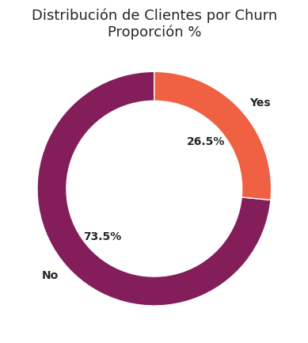
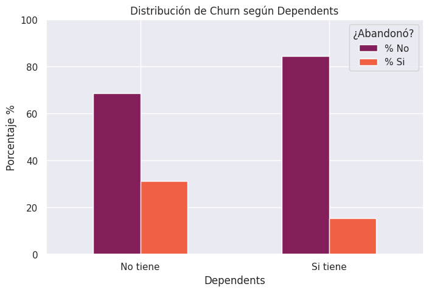
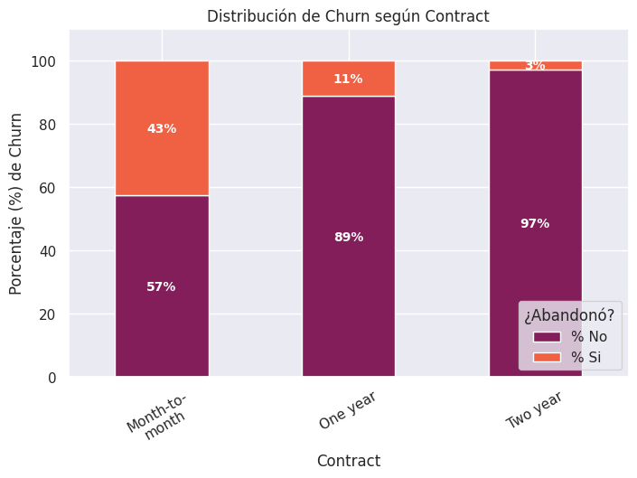

# Análisis de Evasión de clientes: Caso TelecomX

Este proyecto presenta un análisis detallado sobre la fuga de clientes (Churn) en la empresa TelecomX, con el objetivo de identificar patrones predictivos que permitan mejorar las estrategias de retención.

## 📋 Resumen del Proyecto
El análisis aborda el proceso completo de ciencia de datos, desde la extracción y limpieza de información semiestructurada hasta la identificación de factores clave de abandono, como la antigüedad del usuario, tipos de contrato y métodos de pago.

## 🛠️ Herramientas Utilizadas
El análisis se desarrolló en Python utilizando las siguientes librerías:
* **Pandas & Numpy**: Para la manipulación y transformación de datos.
* **Seaborn & Matplotlib**: Para la generación de visualizaciones estadísticas.

## 📁 Estructura del Proyecto y Contenido
El análisis sigue una metodología rigurosa dividida en las siguientes etapas:

1. **Introducción:** Contexto del problema de negocio en TelecomX.
2. **📌 Extracción:** Obtención de datos semiestructurados (JSON) desde repositorios externos.
3. **🔧 Transformación:**
    * **Diccionario de datos:** Definición de variables clave.
    * **Identificación de variables para Churn:** Selección de indicadores críticos.
    * **Estandarización:** Normalización de formatos y tipos de datos.
    * **Limpieza:** Tratamiento de valores ausentes e incoherencias.
4. **📊 Carga y Análisis:**
    * **Distribución de Churn:** Proporción numérica y visual de la evasión.
    * **Patrones Personales:** Análisis por género, edad (SeniorCitizen), pareja y dependientes.
    * **Patrones Contractuales:** Impacto del tipo de contrato y métodos de pago.
    * **Patrones de Servicio:** Influencia del servicio de internet y telefonía en la retención.
    * **Análisis Temporal y Económico:** Relación entre *Tenure*, *Monthly Charges* y *Total Charges*.
5. **📄 Informe Final:**
    * **Perfil de riesgo:** Identificación del cliente con mayor probabilidad de fuga.
    * **Factores Críticos:** Ranking de variables con mayor impacto.
    * **Estrategias:** Recomendaciones accionables para reducir el Churn.
    * **Conclusiones.**

## 📊 Hallazgos Principales
* **Tasa de Abandono**: Se identificó una tasa de churn del **26.5%**, lo que representa que aproximadamente 1 de cada 4 clientes cancela el servicio.

* **Perfil de Riesgo**: Los clientes adultos mayores (>= 65 años) y aquellos sin pareja o dependientes muestran una mayor propensión al abandono.

* **Factores Contractuales**: El tipo de contrato y los cargos mensuales son variables críticas en la decisión de permanencia.

## ⚙️ Proceso Técnico
1. **Extracción**: Carga de datos desde repositorio externo en formato JSON.
2. **Transformación**: Normalización de estructuras anidadas y limpieza de 7,267 registros.
3. **Análisis (EDA)**: Inspección de variables binarias, categóricas y numéricas para detectar inconsistencias y patrones.

## 🚀 Cómo ejecutar
1. Clona el repositorio.
2. Asegúrate de tener instaladas las dependencias: `pip install pandas numpy seaborn matplotlib`.
3. Ejecuta el notebook `TelecomX_LATAM.ipynb` para reproducir el análisis.
